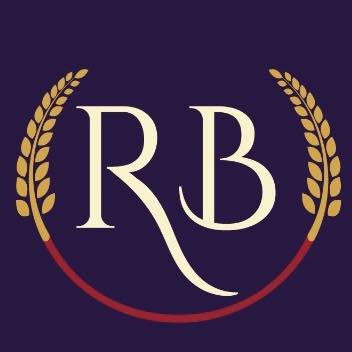

# 🍞 Ravon Bakers & Restaurant POS System

<p align="center">
  
</p>

<p align="center">
  <strong>A Complete Restaurant Management & Point of Sale System</strong>
</p>

<p align="center">
  
  
  
  
</p>

## 📋 About Ravon Bakers POS

Ravon Bakers POS is a comprehensive restaurant management system designed specifically for bakeries and restaurants. Built with Laravel 11, it provides a complete solution for managing daily operations, inventory, sales, and customer transactions.

### 🎯 Key Features

- **🛒 Point of Sale (POS) System** - Modern, intuitive interface for order processing
- **📦 Inventory Management** - Real-time stock tracking with automatic updates
- **👥 User Management** - Role-based access control (Admin/Staff)
- **📊 Sales Reporting** - Daily sales reports and analytics
- **🏷️ Category Management** - Organize items by categories (Bakery, Beverages, etc.)
- **💳 Multiple Payment Methods** - Cash, Card, Credit, and Mixed payments
- **🧾 Receipt Generation** - Professional receipts with logo branding
- **📱 Responsive Design** - Works on desktop, tablet, and mobile devices
- **🔄 Stock Automation** - Automatic inventory reduction on sales
- **♻️ Soft Delete System** - Item reactivation without data loss

## 🚀 Quick Start

### Prerequisites

- **PHP** >= 8.1
- **Composer** 
- **Node.js** & npm (for asset compilation)
- **SQLite** (included with PHP)

### Installation

1. **Clone the repository**
   ```bash
   git clone https://github.com/SACHITH-KAVISHKA/Ravon-Bakers-and-Restaurant-POS-new.git
   cd Ravon-Bakers-and-Restaurant-POS-new
   ```

2. **Install PHP dependencies**
   ```bash
   composer install
   ```

3. **Install Node.js dependencies**
   ```bash
   npm install
   ```

4. **Environment setup**
   ```bash
   cp .env.example .env
   php artisan key:generate
   ```

5. **Database setup**
   ```bash
   php artisan migrate
   php artisan db:seed
   ```

6. **Build assets**
   ```bash
   npm run build
   ```

7. **Start the development server**
   ```bash
   php artisan serve
   ```

8. **Access the application**
   - Open your browser and visit: `http://localhost:8000`
   - Default admin credentials will be provided after seeding

## 🖥️ System Requirements

| Component | Minimum | Recommended |
|-----------|---------|-------------|
| PHP | 8.1 | 8.2+ |
| Memory | 512MB | 1GB+ |
| Storage | 1GB | 2GB+ |
| Database | SQLite | SQLite/MySQL |

## 📱 Features Overview

### 🏪 Point of Sale Interface
- **Category-based item selection**
- **Real-time cart management**
- **Stock validation**
- **Multiple payment processing**
- **Receipt printing**
- **Fullscreen mode**

### 📦 Inventory Management
- **Add/Edit/Delete items**
- **Stock quantity tracking**
- **Low stock alerts**
- **Category organization**
- **Price management**
- **Soft delete with reactivation**

### 👨‍💼 User Management
- **Role-based permissions**
- **Admin and Staff roles**
- **User registration (Admin only)**
- **Profile management**

### 📊 Reporting
- **Daily sales reports**
- **Item-wise sales analysis**
- **Payment method breakdown**
- **Export capabilities**

## 🛠️ Configuration

### Database Configuration
The system uses SQLite by default. To switch to MySQL:

1. Update `.env` file:
   ```env
   DB_CONNECTION=mysql
   DB_HOST=127.0.0.1
   DB_PORT=3306
   DB_DATABASE=ravon_pos
   DB_USERNAME=your_username
   DB_PASSWORD=your_password
   ```

### Logo Setup
1. Place your logo as `logo.jpg` in `public/images/`
2. The logo will automatically appear in:
   - Sidebar navigation
   - POS header
   - Receipt templates
   - Browser favicon

## 🚦 Running in Production

### Production Deployment

1. **Optimize for production**
   ```bash
   composer install --optimize-autoloader --no-dev
   php artisan config:cache
   php artisan route:cache
   php artisan view:cache
   ```

2. **Set production environment**
   ```env
   APP_ENV=production
   APP_DEBUG=false
   ```

3. **Configure web server** (Apache/Nginx)
   - Point document root to `public/` directory
   - Configure URL rewriting

## 🔧 Maintenance Commands

```bash
# Clear all caches
php artisan optimize:clear

# Backup database
php artisan backup:run

# Check system status
php artisan about

# Run queue workers (if using)
php artisan queue:work
```

## 📚 Usage Guide

### First Time Setup

1. **Admin Login** - Use seeded admin credentials
2. **Add Categories** - Create item categories (Bakery, Beverages, etc.)
3. **Add Items** - Set up your menu items with prices and stock
4. **Create Staff Users** - Add staff members with appropriate roles
5. **Start Selling** - Access POS system and begin processing orders

### Daily Operations

1. **Morning Setup** - Check inventory levels
2. **Process Sales** - Use POS for customer transactions
3. **Monitor Stock** - Track low stock items
4. **End of Day** - Generate sales reports

## 🤝 Contributing

We welcome contributions to improve the Ravon Bakers POS system!

1. Fork the repository
2. Create a feature branch (`git checkout -b feature/AmazingFeature`)
3. Commit your changes (`git commit -m 'Add some AmazingFeature'`)
4. Push to the branch (`git push origin feature/AmazingFeature`)
5. Open a Pull Request

## 🆘 Support

If you encounter any issues or need support:

1. Check the [Issues](https://github.com/SACHITH-KAVISHKA/Ravon-Bakers-and-Restaurant-POS-new/issues) page
2. Create a new issue with detailed information
3. Contact the development team

## 📄 License

This project is licensed under the MIT License - see the [LICENSE](LICENSE) file for details.

## 👨‍💻 Development Team

- **Lead Developer**: Sachith Kavishka
- **System Design**: SKM Labs
- **UI/UX**: Modern Bootstrap 5 Implementation

## 🙏 Acknowledgments

- Built with [Laravel](https://laravel.com) - The PHP Framework for Web Artisans
- UI Components powered by [Bootstrap 5](https://getbootstrap.com)
- Icons by [Bootstrap Icons](https://icons.getbootstrap.com)
- Database management with [SQLite](https://sqlite.org)

---

<p align="center">
  <strong>🍞 Made with ❤️ for Ravon Bakers & Restaurant</strong><br>
  <em>Powering efficient restaurant operations since 2025</em>
</p>
